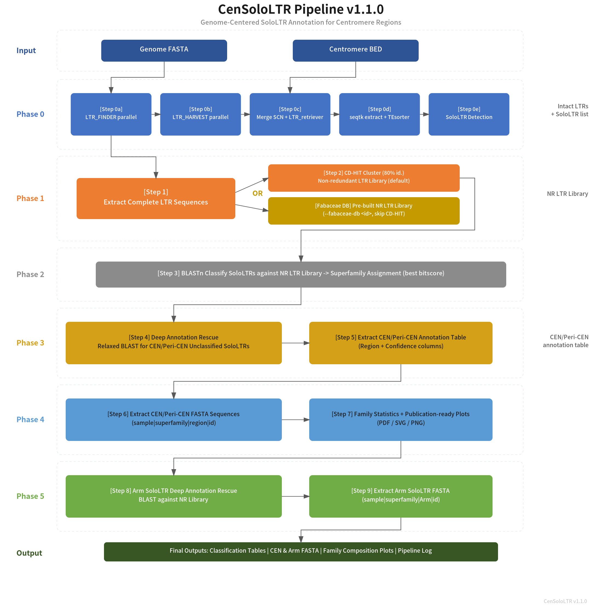

# CenSoloLTR v1.1.0

**Genome-Centered SoloLTR Annotation Pipeline for Centromere Regions**

An integrated bioinformatics pipeline for *de novo* LTR retrotransposon annotation, soloLTR detection, and centromere/pericentromere/arm region analysis.



## Overview

Starting from a genome FASTA file and a centromere BED file, the pipeline executes 6 phases (10 steps) to produce:

- **Phase 0**: *De novo* LTR annotation (LTR_FINDER, LTR_HARVEST, LTR_retriever, TEsorter, SoloLTR detection)
- **Phase 1**: LTR library construction (Complete LTR extraction, CD-HIT NR library)
- **Phase 2**: SoloLTR classification via BLASTn against NR LTR library
- **Phase 3**: CEN/Peri-CEN deep annotation with relaxed BLAST rescue of unclassified hits
- **Phase 4**: FASTA extraction (CEN/Peri-CEN) + family composition publication-ready plots
- **Phase 5**: Arm region SoloLTR deep annotation rescue + FASTA extraction

---

## Installation

### Step 1: Clone the Repository

```bash
git clone https://github.com/user/CenSoloLTR.git
cd CenSoloLTR
```

### Step 2: Install Dependencies

Run the one-click dependency installation script:

```bash
bash install_dependencies.sh
```

This script will:

1. Create a conda environment named `censololtr` with all required bioinformatics tools (minimum version requirements, not pinned to exact versions)
2. Install required R packages (CRAN + Bioconductor)
3. Build and install the **CenSoloLTR** R package from source
4. Create a `CenSoloLTR` CLI wrapper in the conda environment's `bin/` directory

**Prerequisite:** [Miniconda3](https://docs.conda.io/en/latest/miniconda.html) or Anaconda3 must be installed.

### Step 3: Activate the Environment

```bash
conda activate censololtr
```

### Step 4: Verify Installation

```bash
CenSoloLTR --version
CenSoloLTR --help
```

If both commands print expected output, the installation is complete.

---

## Requirements

### External Tools (minimum versions)

| Tool | Minimum Version | Purpose | Phase |
|------|-----------------|---------|-------|
| LTR_FINDER | >= 1.2 | *De novo* LTR detection | 0a |
| LTR_FINDER_parallel | >= 1.4 | Parallel genome chunking for LTR_FINDER | 0a |
| LTR_HARVEST_parallel | >= 1.3 | Parallel genome chunking for LTR_HARVEST | 0b |
| LTR_HARVEST | >= 1.6.2 | 0b |
| GenomeTools (gt) | >= 1.6.6 | LTR harvest via `gt ltrharvest` | 0b |
| LTR_retriever | >= 2.9.0 | High-confidence LTR filtering | 0c |
| TEsorter | >= 1.3 | LTR superfamily classification | 0d |
| RepeatMasker | >= 4.1.2 | Repeat masking for soloLTR detection | 0e |
| BLAST+ | >= 2.9 | Sequence similarity search | 3, 4, 8 |
| CD-HIT | >= 4.6 | Non-redundant library clustering | 2 |
| seqtk | >= 1.4 | FASTA sequence extraction | 0d, 3 |
| samtools | >= 1.9 | Genome index (.fai) generation | 4 |

### R Packages

| Package | Source |
|---------|--------|
| Biostrings | Bioconductor |
| dplyr, stringr, readr, tidyr | CRAN (tidyverse) |
| ggplot2, scales, svglite | CRAN |
| optparse, yaml | CRAN |

---

## Quick Start

### Try with Bundled Example Data

The package includes *Arabidopsis thaliana* (Col-0) chromosome 1 as example data. After installation, you can test the pipeline immediately:

```bash
conda activate censololtr

# Locate example data
EXAMPLE_DIR=$(Rscript -e 'cat(system.file("extdata/example", package="CenSoloLTR"))')

# Run pipeline on Chr1 (use Fabaceae DB to skip CD-HIT)
CenSoloLTR \
  -g "${EXAMPLE_DIR}/Chr1.fa" \
  -c "${EXAMPLE_DIR}/Chr1_Cen.bed" \
  -o ./Chr1_output \
  -t 16 \
  --fabaceae-db A17
```

### Basic Run (your own data)

```bash
conda activate censololtr
CenSoloLTR -g genome.fa -c cen.bed -o ./output -t 16
```

### Skip De Novo Detection (use pre-existing Phase 0 results)

```bash
CenSoloLTR -g genome.fa -c cen.bed -o ./output --skip-phase0
```

### Use Pre-built Fabaceae NR LTR Library (skips CD-HIT)

```bash
# List available Fabaceae species
CenSoloLTR --list-db

# Run with a specific Fabaceae database
CenSoloLTR -g genome.fa -c cen.bed -o ./output --fabaceae-db A17
```

### Run Specific Steps Only

```bash
CenSoloLTR -g genome.fa -c cen.bed -o ./output --only-step 3,4,5
```

---

## Input Files

| File | Format | Description |
|------|--------|-------------|
| Genome FASTA (`-g`) | FASTA | Genome assembly with chromosome/contig sequences |
| Centromere BED (`-c`) | BED (3-col) | CEN regions: `chr\tstart\tend` |

The genome `.fai` index is generated automatically by `samtools faidx` if missing.

### Bundled Example Data

The package ships with a small example dataset for testing and demonstration:

| File | Description |
|------|-------------|
| `inst/extdata/example/Chr1.fa` | *Arabidopsis thaliana* Col-0 chromosome 1 (32.6 Mb) |
| `inst/extdata/example/Chr1_Cen.bed` | Centromere coordinate for Chr1 (Chr1:14,841,109–17,559,778) |
| `inst/extdata/example/Chr1.fa.fai` | Pre-built FASTA index |

Access from R:

```r
system.file("extdata/example/Chr1.fa", package = "CenSoloLTR")
system.file("extdata/example/Chr1_Cen.bed", package = "CenSoloLTR")
```

---

## Output Structure

```
output/
├── pipeline.log
├── phase0_ltr_annotation/
│   ├── finder/             # Step 0a: LTR_FINDER SCN output
│   ├── harvest/            # Step 0b: LTR_HARVEST SCN output
│   ├── retriever/          # Step 0c: LTR_retriever pass.list, LTRlib.fa
│   ├── tesorter/           # Step 0d: TEsorter .cls.tsv
│   └── sololtr_detect/     # Step 0e: solo_list
├── phase1_ltr_library/
│   ├── complete_ltr/       # Step 1: Complete_LTR.fasta
│   └── nr_library/         # Step 2: NR_LTR_library.fasta
├── phase2_classification/  # Step 3: final_classification.tsv
├── phase3_annotation/
│   ├── full_annotation/    # Step 4: Full_Integrated.tsv
│   ├── cen_pericen_annotation/  # Step 5: CEN_PeriCEN_SoloLTR.tsv
│   └── arm_annotation/     # Step 8: Arm_SoloLTR.tsv
└── phase4_output/
    ├── fasta/              # Step 6: CEN_PeriCEN_SoloLTR.fa
    ├── arm_fasta/          # Step 9: Arm_SoloLTR.fa
    └── stats_plots/        # Step 7: 12 plots (PDF/SVG/PNG) + 2 summary TSVs
```

---

## CLI Parameters

| Flag | Default | Description |
|------|---------|-------------|
| `-g, --genome` | *(required)* | Genome FASTA file |
| `-c, --cen-bed` | *(required)* | Centromere BED file |
| `-o, --outdir` | `./CenSoloLTR_output` | Output directory |
| `-t, --threads` | `8` | CPU threads (BLAST, CD-HIT) |
| `--ltr-threads` | `threads` | Threads for LTR detection tools |
| `--conda-env` | — | Conda environment name/path for tool resolution |
| `--sample-name` | auto | Sample name prefix for output files |
| `--skip-phase0` | `FALSE` | Skip *de novo* LTR annotation |
| `--skip-step` | — | Comma-separated steps to skip |
| `--only-step` | — | Comma-separated steps to run |
| `--fabaceae-db` | — | Use pre-built Fabaceae NR LTR library (ID) |
| `--list-db` | — | List available Fabaceae species and exit |
| `--top-families` | `15` | Top N LTR families in plots |
| `--peri-extension-bp` | `500000` | Pericentromere fixed extension in bp |
| `--blast-evalue` | `1e-5` | BLAST e-value for classification |
| `--blast-evalue-rescue` | `1.0` | BLAST e-value for rescue search |
| `--cdhit-identity` | `0.80` | CD-HIT sequence identity cutoff |
| `--cdhit-coverage` | `0.80` | CD-HIT alignment coverage cutoff |
| `--config` | — | YAML config file path |
| `--gen-config` | — | Generate default YAML config and exit |
| `--quiet` | `FALSE` | Suppress progress messages |
| `-v, --version` | — | Print version and exit |
| `-h, --help` | — | Print help and exit |

---

## Fabaceae Pre-built Database

CenSoloLTR bundles 18 pre-computed NR LTR libraries from published Fabaceae genomes. Using `--fabaceae-db <ID>` skips CD-HIT clustering (Step 2) entirely.

```bash
CenSoloLTR --list-db          # List all 18 available species
CenSoloLTR --db-info A17      # Show genome details for one species
```

---

## License

MIT License — see [LICENSE](LICENSE) file for details.

## Citation
(UnPublished)
